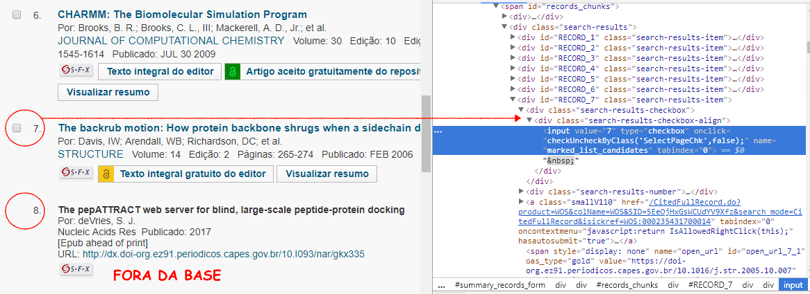

# Etapa Auxiliar - Citações

A última etapa consiste em armazenar todas as citações feitas por cada artigo. Para otimizar esse processo, a extração foi dividida por grupos de periódicos (vários notebooks foram abertos e para cada um deles foi selecionado um grupo de periódicos para executar a função de captura dos artigos citados). 

Para cada periódico foram gerados três arquivos, por exemplo, para o periódico com `journal_id=1` foram salvos `articles_cit_ID_J_1.csv`, `journals_cit_ID_J_1.csv` e `citations_ID_J_1.csv`. 

Nessa etapa, uma preocupação que surgiu foi como rodar os periódicos separados sem comprometer a integridade da base (lembrando que se o artigo e/ou periódico não corresponde a um do grupo de origem, ele deverá ser inserido - ou seja, o ID não pode ser um simples sequencial numérico). Dessa forma, tornou-se necessário o uso do número de registro do próprio WoS como o ID dos artigos e o ISSN como o ID dos periódicos.

Ao final do processo, todas as citações foram concatenadas em [citations.csv](https://www.dropbox.com/s/v958ik5b2vpgdul/citations.csv?dl=0). As informações sobre os artigos e periódicos foram concatenadas e atualizadas (os resultados acumulados foram somados) em [articles_cit.csv]() e [journals_cit.csv](https://github.com/anacwagner/WOS_CitationNetworks/blob/master/outputs/journals_cit.csv).

## Observações

* Muitos artigos citam artigos que não estão na base do WoS e, portanto não possuem o número de registro usado como ID. 

* Da mesma forma, muitos periódicos citados não estão na base e com isso não é fácil a obtenção do ISSN dele. 

* Os artigos fora da base foram identificados no código como os que não possuem uma *checkbox*.

 

* Os artigos fora da base que precisaram ser inseridos foram identificados da seguinte forma: o ID e título dos artigos como "FORA DA BASE" e o ID do periódico com o próprio nome dele. 

