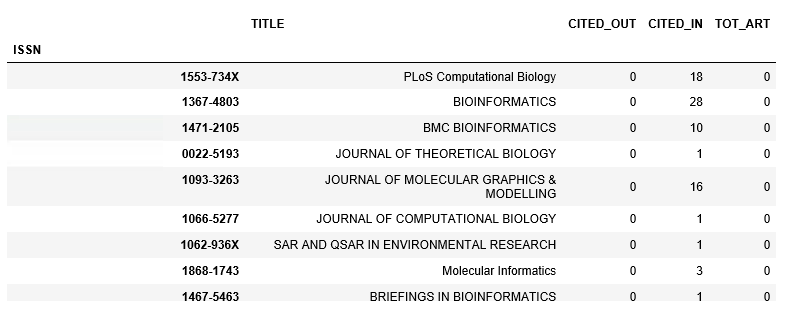
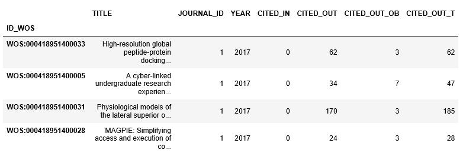
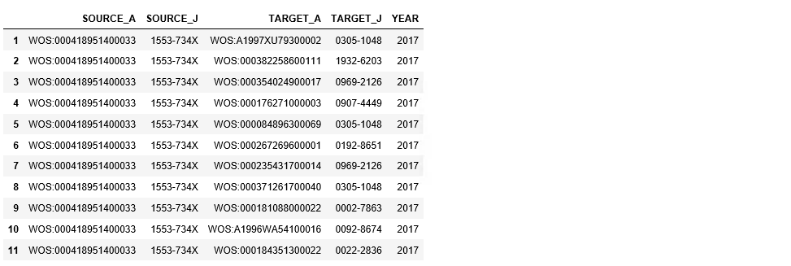
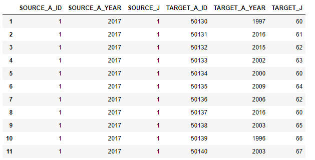

# Estruturas dos *Data Frames* 

## *Journals*

O [journals_cit](https://github.com/anacwagner/WOS_CitationNetworks/blob/master/outputs/journals_cit.csv), possui informações sobre os periódicos utilizados na construção da rede de citações: 

* `ISSN` - ID do periódico;

* `TITLE` - nome do periódico;

* `CITED_OUT` - grau de saída total;

* `CITED_IN` - grau de entrada total;

* `TOT_ART` - total de artigos publicados.

## Artigos

O [articles_cit](https://www.dropbox.com/s/kzl7ykd1drw46l2/articles_cit.csv?dl=0), possui informações sobre os aartigos utilizados na construção da rede de citações: 

* `ID_WOS` - ID do artigo;

* `TITLE` - nome do artigo;

* `JOURNAL_ID` - ID do periódico que publicou o artigo. Está relacionados aos 59 periódicos da categoria selecionada;

* `YEAR` - ano que o artigo foi publicado;

* `CITED_IN` - quantidade de citações recebidas (artigos que citaram ele);

* `CITED_OUT` - quantidade de citações realizadas (artigos que ele citou - que usou em sua referência);

* `CITED_OUT_OB` - quantidade de citações realizadas que estão fora da base do WoS. Ou seja, das citações registradas na coluna anterior, quais delas foram para fora da base do WoS;

* `CITED_OUT_T` - quantidade total de citações realizadas. Corresponde a quantidade que aparece no topo da página. Nem todas as citações foram extraídas, pois algumas não tinhas informações completas.

## Citações

O data frame [citations](https://www.dropbox.com/s/nc990di3jeaa6jf/citations.csv?dl=0) contém as informações da rede.

* `SOURCE_A` - ID do artigo que está citando. Para os que estão na base, corresponde ao número de registro do artigo no WoS. Para os que estão fora da base, corresponde à identificação "FORA DA BASE";

* `SOURCE_J` - ID do periódico que contém o artigo que está citando. Para os que estão na base, corresponde ao ISSN do periódico. Para os que estão fora da base, corresponde ao próprio título do periódico;

* `TARGET_A` - ID do artigo que está sendo citado. Para os que estão na base, corresponde ao número de registro do artigo no WoS. Para os que estão fora da base, corresponde à identificação "FORA DA BASE";

* `TARGET_J` - ID do periódco que contém o artigo que está sendo citado. Para os que estão na base, corresponde ao ISSN do periódico. Para os que estão fora da base, corresponde ao próprio título do periódico;

* `YEAR` - ano da citação.

No entanto, algumas alterações foram realizadas em sua estrtura de forma a ficar similar a que foi utilizada na simulação WW e ACW: `var_cit` (mais informações visitar o repositório [Citation_Networks](https://github.com/anacwagner/Citation_Networks). Além disso, só está sendo considerado os artigos que estão na base (os artigos identificados como "FORA DA BASE" foram descartados, mas suas respectivas identificações numéricas foram mantidas). 

O data frame [var_cit](https://www.dropbox.com/s/kdqle3l2ccpto4i/var_cit_1.csv?dl=0) possui a seguinte estrutura:

* `SOURCE_A_ID` - agora, o ID do artigo possui um correspondente numérico sequêncial.

* `SOURCE_A_YEAR` - ano de publicação do artigo que está citando. 

* `SOURCE_J_ID` - agora, o ID do periódico possui um correspondente numérico sequêncial.

* `TARGET_A_ID` - agora, o ID do artigo possui um correspondente numérico sequêncial.

* `TARGET_A_YEAR` - ano de publicação do artigo que está sendo citado. 

* `TARGET_J_ID` - agora, o ID do periódico possui um correspondente numérico sequêncial.

